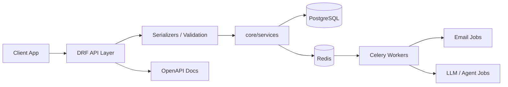

# Bedrock Backend


[](LICENSE)

Production-oriented Django API boilerplate for enterprise multi-tenant SaaS.

Bedrock Backend gives you the backend foundation that serious SaaS products usually
have to assemble from scratch: tenant-aware domain modeling, JWT authentication,
email verification, SSO integration, Celery workers, OpenAPI docs, test-data
tooling, and AI-agent-ready background jobs.

> Not a toy starter. Not a tutorial project.
> A pragmatic backend foundation for building real multi-tenant products.

## What makes it different

Most Django starters stop at authentication and CRUD.

Bedrock Backend focuses on the parts that become painful once a SaaS product grows:

- Tenant-aware data access and domain modeling
- Explicit API / service-layer separation
- JWT authentication, email verification, password reset, and SSO-ready flows
- Celery workers split by queue for default jobs and LLM/agent workloads
- Redis-backed async processing
- PostgreSQL-first local and test environments
- Mailpit for zero-friction local email testing
- OpenAPI documentation with drf-spectacular
- Realistic test-data seeding commands for local development
- Pytest setup with factories and dedicated test containers
- AI-agent-ready services using OpenAI, LangChain, LangGraph, and FAISS

## Quick start

Prerequisites:

- Docker and Docker Compose
- `uv`

```bash
cp dot.env.default .env
uv python install 3.14
uv sync
docker compose up -d postgres redis mailpit celery_default celery_llm celery_beat_default
uv run python manage.py migrate
uv run uvicorn config.asgi:application --reload
```

Mailpit is available at:

```text
http://localhost:8025
```

## Architecture and repository layout

Bedrock Backend intentionally avoids hiding business logic inside DRF viewsets.

The API layer handles HTTP concerns: validation, serialization, permissions,
and response formatting. Domain behavior lives in `core/services/`, with DTOs
used at service boundaries where appropriate.

```text
request.data
  -> Serializer
  -> DTO
  -> Service function
  -> Response
```



This keeps business logic testable, reusable, and independent from the
transport layer.

```text
bedrock_backend/
├── config/                     # Django settings, ASGI/WSGI, Celery app
├── api/                        # REST API layer
│   ├── internal/v1/            # Internal product API
│   ├── external/v1/            # External API, webhooks, integrations
│   ├── permissions/            # API-level permissions
│   └── tests/                  # API tests
├── core/                       # Domain layer
│   ├── models/                 # Django models
│   ├── dtos/                   # DTOs for service boundaries
│   ├── services/               # Business logic
│   ├── jobs/                   # Scheduled/background jobs
│   ├── management/commands/    # Custom Django commands
│   └── migrations/
├── tests/                      # Shared tests, factories, fixtures
├── templates/emails/           # Email templates
└── docker-compose.yml          # Local infrastructure
```

## Tech stack overview

Major technologies used in this repository:

- Python 3.14
- Django 5
- Django REST Framework
- PostgreSQL
- Redis
- Celery
- django-celery-beat
- Uvicorn for ASGI development
- Gunicorn for WSGI deployment
- `uv` for Python environment and dependency management
- Docker Compose for local infrastructure
- Pytest, pytest-django, factory-boy, pytest-xdist
- drf-spectacular for OpenAPI schema/docs
- Simple JWT for token auth
- WorkOS for SSO integration
- OpenAI, LangChain, LangGraph, FAISS for AI/agent workflows
- Mailpit for local email capture

## Local development

### 1. Install prerequisites

You need:

- Docker and Docker Compose
- `uv`
- A PostgreSQL client if you want to connect from the host with `psql`

Install `uv`:

```bash
curl -LsSf https://astral.sh/uv/install.sh | sh
uv --version
```

Sync Python dependencies:

```bash
uv python install 3.14
uv sync
```

If you want `psql` on the host:

```bash
sudo apt install postgresql-client
```

### 2. Configure `.env`

Create your local env file from the template:

```bash
cp dot.env.default .env
```

At minimum, review these variables before starting the app:

```env
APP_NAME=Bedrock
API_SERVER_URL=http://localhost:8000
CLIENT_URL=http://localhost:8080

DJANGO_DEBUG=True
DJANGO_SECRET_KEY=replace-me

POSTGRES_HOST=localhost
POSTGRES_PORT=5432
POSTGRES_DB=postgres_db
POSTGRES_USER=user
POSTGRES_PASSWORD=secret_pass

CELERY_BROKER_URL=redis://localhost:6379/0
CELERY_RESULT_BACKEND=redis://localhost:6379/1

EMAIL_DRIVER=smtp
EMAIL_BACKEND=django.core.mail.backends.smtp.EmailBackend
EMAIL_HOST=localhost
EMAIL_HOST_USER=
EMAIL_HOST_PASSWORD=
EMAIL_PORT=1025
EMAIL_USE_TLS=False
EMAIL_USE_SSL=False
DEFAULT_FROM_EMAIL=noreply@example.local

EMAIL_TEMPLATE_DIR=/app/templates/emails
OPENAI_API_KEY=your-openai-api-key
```

Notes:

- `dot.env.default` is the canonical template.
- The Django settings load `.env` from the repository root.
- For local host-based development, keep `POSTGRES_HOST=localhost` and `CELERY_BROKER_URL=redis://localhost:6379/0`.
- For Celery containers, `docker-compose.yml` overrides database and Redis hosts internally.
- If email is sent from the host-run Django/Uvicorn process, use `EMAIL_HOST=localhost`.
- If email is sent from a Dockerized Celery worker, use `EMAIL_HOST=mailpit`.
- `EMAIL_TEMPLATE_DIR=/app/templates/emails` is the safest choice when using the Dockerized Celery workers locally.
- `DJANGO_TEMPLATE_DIR` and `DJANGO_STATIC_DIR` point to a frontend build directory. If you do not have that frontend locally, adjust those paths as needed for your environment.

### Environment variable reference

The canonical template is `dot.env.default`. Copy it to `.env` and adjust values for your environment.

```bash
cp dot.env.default .env
```

A few values deserve extra care before you start:

- `API_SERVER_URL` is the backend API base URL. `CLIENT_URL` is the browser/client application URL used when generating client-facing links such as SSO redirects. If `CLIENT_URL` is omitted, `settings.py` falls back to `API_SERVER_URL`.
- `ALLOWED_HOSTS` and `CORS_ORIGIN_WHITELIST` are different on purpose. `ALLOWED_HOSTS` expects hostnames such as `localhost,api.workos.com`, while `CORS_ORIGIN_WHITELIST` expects full origins such as `https://localhost:8000,https://api.workos.com`. `settings.py` reads both separately.
- For host-run local development, keep `POSTGRES_HOST=localhost` and `CELERY_BROKER_URL=redis://localhost:6379/0`. For Dockerized Celery workers, `docker-compose.yml` overrides internal database and Redis hosts to `postgres` and `redis`.
- If email is sent from the host-run Django/Uvicorn process, use `EMAIL_HOST=localhost` with Mailpit. If email is sent from a Dockerized Celery worker, use `EMAIL_HOST=mailpit`. `EMAIL_TEMPLATE_DIR=/app/templates/emails` is the safest local value when email jobs run inside the Dockerized workers.
- `DJANGO_TEMPLATE_DIR` and `DJANGO_STATIC_DIR` point to frontend build output and are required by `settings.py`. If you do not have that frontend locally, adjust those paths for your machine.
- When `CELERY_TASK_IGNORE_RESULT=True`, `CELERY_RESULT_BACKEND` is effectively unused. If you turn `CELERY_TASK_IGNORE_RESULT=False`, `CELERY_RESULT_BACKEND` becomes relevant.
- `SSO_ENABLED=False` disables WorkOS configuration loading. When SSO is enabled, `SSO_REDIRECT_PATH` is appended to `CLIENT_URL`, so keep it as a path fragment such as `auth/sso/callback`, not a full URL.

#### Core application

| Variable | Example | Notes |
|---|---|---|
| `APP_NAME` | `Bedrock` | Human-readable application name. |
| `API_SERVER_URL` | `http://localhost:8000` | Backend API base URL. Used as the default backend origin and as the fallback for `CLIENT_URL`. |
| `CLIENT_URL` | `http://localhost:8080` | Browser/client app base URL. Used for client-facing links and redirects such as WorkOS SSO callbacks. Falls back to `API_SERVER_URL` if omitted. |
| `DJANGO_DEBUG` | `False` | Use `True` only for local development. |
| `DJANGO_SECRET_KEY` | `replace-me` | Must be unique and secret outside local development. |

#### Network and cross-origin settings

| Variable | Example | Notes |
|---|---|---|
| `ALLOWED_HOSTS` | `localhost,api.workos.com` | Hostnames only. Do not include `http://` or `https://`. |
| `CORS_ORIGIN_ALLOW_ALL` | `False` | Keep `False` unless you intentionally want unrestricted browser origins. |
| `CORS_ORIGIN_WHITELIST` | `https://localhost:8000,https://api.workos.com` | Full origins including scheme. Useful when browser-based flows need to call external services or callback endpoints. |

#### Logging

| Variable | Example | Notes |
|---|---|---|
| `LOGGER_FILE_PATH` | `/var/log/bedrock/application.log` | File handler target path. |
| `LOGGER_HANDLERS` | `console,file` | Comma-separated handler list. `settings.py` defaults to `file` when omitted. |
| `LOGGER_LEVEL` | `WARNING` | Typical local value is `INFO` or `WARNING`. |

#### Django admin and API docs

| Variable | Example | Notes |
|---|---|---|
| `DJANGO_ADMIN_SITE_ENABLED` | `False` | Enables the Django admin site. |
| `DJANGO_ADMIN_URL` | `division-2/devoffice/` | Path only. `settings.py` normalizes slashes. |
| `API_DOC_LOGIN_URL` | `/developers/auth/` | Path prefix used to build `LOGIN_URL`. |
| `INTERNAL_API_DOC_ENABLED` | `False` | Enables internal API docs. |
| `INTERNAL_API_DOC_URL` | `division-2/develoffice/docs/api/` | Internal docs path. |
| `INTERNAL_API_DOWNLOAD_URL` | `division-2/develoffice/openapi/` | Internal OpenAPI download path. |
| `EXTERNAL_API_DOC_ENABLED` | `False` | Enables external/public API docs. |
| `EXTERNAL_API_DOC_URL` | `public/docs/api/` | External docs path. |
| `EXTERNAL_API_DOWNLOAD_URL` | `public/openapi/` | External OpenAPI download path. |

#### PostgreSQL

| Variable | Example | Notes |
|---|---|---|
| `POSTGRES_HOST` | `localhost` | Use `localhost` for host-run Django. Dockerized Celery overrides this internally to `postgres`. |
| `POSTGRES_PORT` | `5432` | Exposed host port for the dev DB container. |
| `POSTGRES_DB` | `postgres_db` | Database name. |
| `POSTGRES_USER` | `user` | Database username. |
| `POSTGRES_PASSWORD` | `secret_pass` | Database password. |

#### Templates, static files, and media

| Variable | Example | Notes |
|---|---|---|
| `DJANGO_TEMPLATE_DIR` | `bedrock_frontend/dist/` | Frontend build directory used by Django templates. |
| `DJANGO_STATIC_DIR` | `bedrock_frontend/dist/static/` | Frontend static build directory. |
| `EMAIL_TEMPLATE_DIR` | `/app/templates/emails` | Best local value when Celery runs in Docker. Email templates are distinct from browser templates. |
| `MEDIA_ROOT` | `media` | Relative media storage directory under the Django project. |
| `MEDIA_URL` | `/media/` | Public URL prefix for media files. |

#### Celery and Redis

| Variable | Example | Notes |
|---|---|---|
| `CELERY_BROKER_URL` | `redis://localhost:6379/0` | Use host Redis for host-run Django. Dockerized workers override this to `redis://redis:6379/0`. |
| `CELERY_TASK_IGNORE_RESULT` | `True` | If `True`, task results are not stored. |
| `CELERY_TASK_STORE_ERRORS_EVEN_IF_IGNORED` | `True` | Useful when task results are ignored but failures should still be captured. |
| `CELERY_RESULT_BACKEND` | `redis://localhost:6379/1` | Matters only when `CELERY_TASK_IGNORE_RESULT=False`. |

#### Authentication and JWT

| Variable | Example | Notes |
|---|---|---|
| `ACCESS_TOKEN_LIFETIME_MINS` | `30` | JWT access token lifetime in minutes. |
| `REFRESH_TOKEN_LIFETIME_DAYS` | `30` | JWT refresh token lifetime in days. |
| `UPDATE_LAST_LOGIN` | `True` | Controls whether successful login updates the Django last-login timestamp. |

#### Email

| Variable | Example | Notes |
|---|---|---|
| `EMAIL_DRIVER` | `smtp` | Keep this concrete in `.env`. Avoid placeholder strings like `gmail or smtp`. |
| `EMAIL_BACKEND` | `django.core.mail.backends.smtp.EmailBackend` | SMTP backend used for both Gmail and Mailpit setups. |
| `EMAIL_HOST` | `localhost` | For host-run local Mailpit. Use `mailpit` for Dockerized workers. |
| `EMAIL_HOST_USER` | `` | Empty for Mailpit. Set a real account for Gmail or another SMTP provider. |
| `EMAIL_HOST_PASSWORD` | `` | Empty for Mailpit. Set a real app password or SMTP secret for a real provider. |
| `EMAIL_PORT` | `1025` | Mailpit local SMTP port. Gmail commonly uses `587`. |
| `EMAIL_USE_TLS` | `False` | `False` for Mailpit, usually `True` for Gmail on `587`. |
| `EMAIL_USE_SSL` | `False` | Usually stays `False` unless your provider requires SSL directly. |
| `DEFAULT_FROM_EMAIL` | `noreply@example.local` | Safe local default sender. |
| `EMAIL_VERIFICATION_CODE_LENGTH` | `32` | Verification code length. |
| `EMAIL_VERIFICATION_CODE_LIFETIME_HOURS` | `24` | Verification code expiration in hours. |

#### API limits and security controls

| Variable | Example | Notes |
|---|---|---|
| `TENANT_DOMAIN_LENGTH` | `32` | Generated tenant domain length. |
| `TENANT_ACCOUNT_ID_LENGTH` | `48` | Generated tenant account ID length. |
| `TENANT_INVITATION_CODE_LENGTH` | `32` | Invitation code length. |
| `TENANT_INVITATION_CODE_LIFETIME_HOURS` | `72` | Invitation validity in hours. |
| `TENANT_INVITATION_CODE_REQUEST_MAX_SIZE` | `200` | Maximum batch size when requesting invitation codes. |
| `FAILED_LOGIN_ATTEMPT_MAX_COUNT` | `5` | Lockout threshold. |
| `LOGIN_LOCK_PERIOD_MINS` | `10` | Lockout duration. |
| `PASSWORD_RESET_CODE_LENGTH` | `32` | Password reset code length. |
| `PASSWORD_RESET_CODE_LIFETIME_HOURS` | `24` | Password reset validity in hours. |
| `DRF_THROTTLE_RATES_ANONYMOUS` | `1000/h` | DRF anonymous throttle rate. |
| `DRF_THROTTLE_RATES_USER` | `6000/h` | DRF authenticated-user throttle rate. |

#### AI and Google integration

| Variable | Example | Notes |
|---|---|---|
| `OPENAI_API_KEY` | `sk-...` | Optional unless you use AI/agent features. |
| `GOOGLE_SERVICE_ACCOUNT_PATH` | `/app/secrets/service-account.json` | For local Docker-based workflows, keep this as a path visible inside the container. Leave empty if unused. |

#### WorkOS SSO

| Variable | Example | Notes |
|---|---|---|
| `SSO_ENABLED` | `False` | Enables WorkOS SSO settings. When `False`, WorkOS API key, client ID, and redirect URI are not loaded. |
| `SSO_WORKOS_API_KEY` | `<WorkOS secret key>` | Required only when `SSO_ENABLED=True`. |
| `SSO_WORKOS_CLIENT_ID` | `<WorkOS client id>` | Required only when `SSO_ENABLED=True`. |
| `SSO_REDIRECT_PATH` | `auth/sso/callback` | Path fragment appended to `CLIENT_URL`. Do not make this a full URL. |

#### Test and SSO fixture values

| Variable | Example | Notes |
|---|---|---|
| `TEST_SSO_DOMAIN` | `example.onmicrosoft.com` | Useful for local/manual SSO testing if you keep dedicated fixture values. |
| `TEST_WORKOS_CONNECTION_ID` | `conn_XXXX` | Test WorkOS connection fixture. |
| `TEST_SSO_USER_EMAIL` | `user@example.com` | Test SSO user email. |
| `TEST_SSO_USER_FIRST_NAME` | `Daichi` | Test SSO first name. |
| `TEST_SSO_USER_LAST_NAME` | `Yoshikawa` | Test SSO last name. |

### 3. Start local infrastructure

Bring up the core development services:

```bash
docker compose up -d postgres redis mailpit celery_default celery_llm celery_beat_default
```

If you also want the dedicated test infrastructure running:

```bash
docker compose up -d postgres_test redis_test
```

Run Django migrations:

```bash
uv run python manage.py migrate
```

### 4. Check service status

Check all running containers:

```bash
docker compose ps
```

Follow logs for a specific service:

```bash
docker compose logs -f postgres
docker compose logs -f redis
docker compose logs -f celery_default
docker compose logs -f celery_llm
docker compose logs -f celery_beat_default
docker compose logs -f mailpit
```

Check PostgreSQL from the host:

```bash
psql -U user -h 127.0.0.1 -p 5432 -d postgres_db
```

Check PostgreSQL from inside the container:

```bash
docker exec -it bedrock_postgres_dev psql -U user -d postgres_db
```

Check Redis:

```bash
docker exec -it bedrock_redis_dev redis-cli ping
```

Expected response:

```text
PONG
```

## Mailpit

Mailpit captures outgoing email in local development so you can test verification, password reset, invitations, and welcome emails without touching a real SMTP provider.

Start it:

```bash
docker compose up -d mailpit
```

Open the Mailpit UI:

- http://localhost:8025

SMTP settings for Mailpit:

```env
EMAIL_DRIVER=smtp
EMAIL_BACKEND=django.core.mail.backends.smtp.EmailBackend
EMAIL_HOST=localhost
EMAIL_PORT=1025
EMAIL_USE_TLS=False
EMAIL_USE_SSL=False
DEFAULT_FROM_EMAIL=noreply@example.local
```

If the email sender runs inside Docker, switch `EMAIL_HOST` to `mailpit`.

## Run the development server

This repository is ASGI-ready. For local development, use Uvicorn:

```bash
uv run uvicorn config.asgi:application --reload
```

Useful variants:

```bash
uv run uvicorn config.asgi:application --reload --host 0.0.0.0 --port 8000
uv run uvicorn config.asgi:application --reload --host localhost --port 8000
```

If you need the classic Django dev experience with extensions:

```bash
uv run python manage.py runserver_plus
```

## Prepare test data

The repository includes management commands for seeding realistic local data.

### Download sample avatars

This command fetches avatar images for seeded users. It requires network access.

```bash
uv run python manage.py download_avatars --males 50 --females 50 --seed 42
```

### Insert a complete base dataset

This command can reset the database, migrate it, create users, and create a tenant. It does not create tenant users.

```bash
uv run python manage.py insert_test_data --reset_db yes --seed 42
```

### Insert users only

```bash
uv run python manage.py insert_test_users --count 100 --seed 42
```

### Insert one tenant

`admin_user_id` should point to an existing user who will become the tenant admin.

```bash
uv run python manage.py insert_test_tenant --admin_user_id 1 --plan_uid 1 --seed 42
```

### Insert tenant users

Use the tenant domain you created earlier.

```bash
uv run python manage.py insert_test_tenant_users --domain yourtenantdomain --count 50 --admins_count 2 --managers_count 5 --seed 42
```

Recommended order for a fresh local setup:

```bash
uv run python manage.py download_avatars --males 50 --females 50 --seed 42
uv run python manage.py insert_test_users --count 100 --seed 42
uv run python manage.py insert_test_tenant --admin_user_id 1 --plan_uid 1 --seed 42
uv run python manage.py insert_test_tenant_users --domain yourtenantdomain --count 50 --admins_count 2 --managers_count 5 --seed 42
```

## Celery workers and tasks

This project uses separate Celery services for different workloads:

- `celery_default`: default queue
- `celery_llm`: LLM and agent-related jobs
- `celery_beat_default`: scheduled and periodic jobs

### Start or restart workers

Start them:

```bash
docker compose up -d celery_default celery_llm celery_beat_default
```

Restart after Python code changes:

```bash
docker compose restart celery_default celery_llm celery_beat_default
```

### Rebuild workers after dependency or image changes

If `pyproject.toml`, `uv.lock`, Dockerfile content, or compose env wiring changed, rebuild and recreate containers:

```bash
docker compose stop celery_default celery_llm celery_beat_default
docker compose build --no-cache celery_default celery_llm celery_beat_default
docker compose up -d --force-recreate celery_default celery_llm celery_beat_default
```

### Inspect worker logs

```bash
docker compose logs -f celery_default
docker compose logs -f celery_llm
docker compose logs -f celery_beat_default
```

### Task registration

Tasks are imported explicitly in `config/settings.py` via `CELERY_IMPORTS`:

- `core.services.agent.tasks`
- `core.services.email.tasks`

If you add a new task module, make sure it is imported there, then restart the workers.

### Queue routing

- Default jobs go to the `default` queue.
- Agent/LLM jobs are routed to the `llm` queue.

## Run tests

The test suite expects the dedicated test PostgreSQL and Redis containers:

```bash
docker compose up -d postgres_test redis_test
```

Run pytest:

```bash
uv run pytest
```

Useful variants:

```bash
uv run pytest --create-db
uv run pytest -n auto
uv run pytest api/tests
uv run pytest core/tests
```

Notes:

- `pytest.ini` is configured with `--reuse-db` by default.
- `tests/env.test` supplies the test environment variables.
- Use `--create-db` when the schema changed or the reused database became stale.

## Troubleshooting

### `.env` changes do not seem to apply

- Django reads `.env` from the repo root.
- Celery containers read `.env` and also receive some overrides from `docker-compose.yml`.
- If you changed only Python code, restart the workers.
- If you changed dependency files, Docker config, or env wiring, rebuild and recreate the Celery containers.

### Django cannot connect to PostgreSQL

Check:

- `docker compose ps`
- `docker compose logs -f postgres`
- `.env` values for `POSTGRES_HOST`, `POSTGRES_PORT`, `POSTGRES_DB`, `POSTGRES_USER`, `POSTGRES_PASSWORD`

For host-based local development, `POSTGRES_HOST` should usually be `localhost`.

### Celery workers are up but tasks are not running

Check:

- Redis is running: `docker exec -it bedrock_redis_dev redis-cli ping`
- Worker logs: `docker compose logs -f celery_default` or `docker compose logs -f celery_llm`
- The task module is listed in `CELERY_IMPORTS`
- The task is being sent to the right queue

### Emails are not showing in Mailpit

Check:

- `docker compose up -d mailpit`
- Mailpit UI is reachable at `http://localhost:8025`
- If the sender runs on the host, `.env` should point to `EMAIL_HOST=localhost` and `EMAIL_PORT=1025`
- If the sender runs in a Dockerized Celery worker, `.env` should point to `EMAIL_HOST=mailpit` and `EMAIL_PORT=1025`
- The app or worker that sends email was restarted after `.env` changes

### `download_avatars` fails

That command fetches images from the network. Common causes:

- No internet connection
- External API temporarily unavailable
- Corporate proxy/firewall restrictions

You can still seed users and tenants without downloading avatars first.

### Pytest is failing with stale schema or DB reuse issues

Run:

```bash
uv run pytest --create-db
```

Also confirm that `postgres_test` and `redis_test` are running.

### Frontend template/static paths break local startup

The settings reference frontend build output via:

- `DJANGO_TEMPLATE_DIR`
- `DJANGO_STATIC_DIR`

If your frontend build is not present locally, adjust those paths in `.env` or provide the expected build output.

## Dependency management

Do not edit `pyproject.toml` or `uv.lock` by hand unless you have a very specific reason.

Use:

```bash
uv add <package>
uv remove <package>
uv lock
uv sync
```

## License

This repository is licensed under the MIT License.
See [LICENSE](LICENSE) for details.
